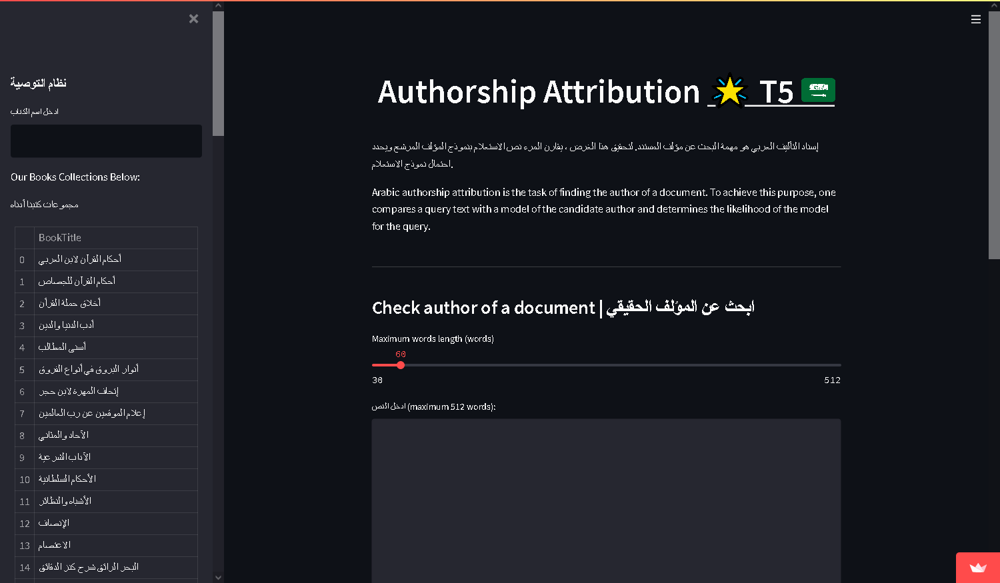

# Authorship Attribution
## Abstract
King Fahad library is looking for a way to help visitors find Arabic authors based on the author’s writing style and recommend books with similar writing style.  

## Design
The data was provided by [SDAIA](https://sourceforge.net/projects/tashkeela/) which in turn is collected from Al-Maktaba Al-shamela. The assumbtion is that the type of words used (adj, verbs, past, etc...) and the pattern in which they are arranged could give a hint about who the author is.  

## Data
The dataset contains 97 documents, 97 book titles, and 80 authors names which had to be collected manually.

## Algorithms
### Pre-processing
1.	Removing tashkeel.
2.	Removing Quran vrases and Ahadeth.

## Models  
### Classification  
1. Transfer Learning: AraBERT.  
2. From scratch: Bi-LSTM.  

### Recommender  

## Model Evaluation and Selection   
### Classification model
1.	The dataset observations of 230k were split into train, validation, and test.
2.	The evaluation of our classification models were based on F1-score.  

## Tools
Tools: Python, and Jupyter Notebook. 
Libraries: Pandas, numpy, PyArabic, keras, Sci-Kit Learn, tensorflow, matplotlib, regex.
## Communication
In addition to the slides, we made a [DashBoard](https://share.streamlit.io/a-safarji/books-recommnder-/main/basedon_user.py) to show our results and use the model

