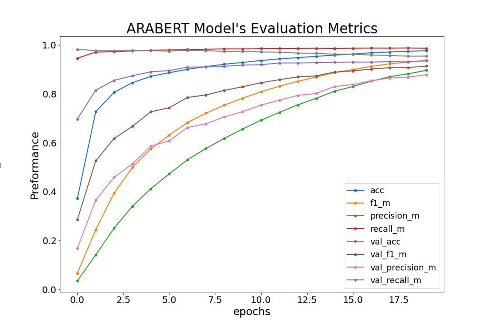

# Authorship Attribtion
Allowing the library visitors to search books by a sentence will increase the number of repeated customers and attract new ones due to the ability of searching using sentences instead of author name or book name.

  

This graph shows that Arabert can extract the writing style of each author with great confidence.
