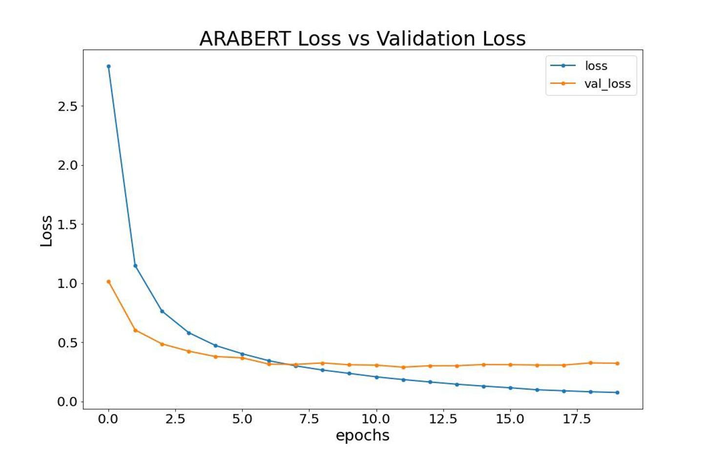

# T5_AuthorAttribution

# Project Motivation  
The Arabic langauge is a big challenge in the NLP domian because of its huge vocabulary and versatility, in addition it does not get enough attention making it a difficult challenge to overcome. Therefore King Fahad library is looking for a way to help visitors find Arabic authors based on the author’s writing style and recommend books with similar writing style to get more people into reading by helping them finding books from a certain writing style.  

# File Descriptions  
Proposal- Folder containing the project's proposal  
MVP- Folder containing the project's Minimum vaiable product  
Code_Slides_writeup- Folder containing the project's notebook (in code folder), PowerPoint presentation (in slides folder), and a summery (in writeup folder)

# How To Interact With Your Project  
Open the notebook in jupyter notebook to view the code and technical details, or read the slides for a quick view about our findings, or visit the project's [website](https://share.streamlit.io/a-safarji/books-recommnder-/main/basedon_user.py).  

# ِAdditional Information  
[Recommender System](https://github.com/A-safarji/Books-Recommnder-)

# Results Summery  
AraBert performed amazingly will dispaite some documents being very short and some authores having 2-3 huge books.  
  

  

# Acknowledgment  
I would like to thank my teammates [Ahmed Al-Jimiai](https://github.com/AAljmiai)  , and [Abdultawwab Safarji](https://github.com/A-safarji) for their amazing work and support.
And a special thanks for [SDAIA](https://sourceforge.net/projects/tashkeela/) for providing the dataset.

# Team Memebers
1- [Hazim Bukhari](https://github.com/FancyWhale69)  
2- [Ahmed Al-Jimiai](https://github.com/AAljmiai)  
3- [Abdultawwab Safarji](https://github.com/A-safarji)
